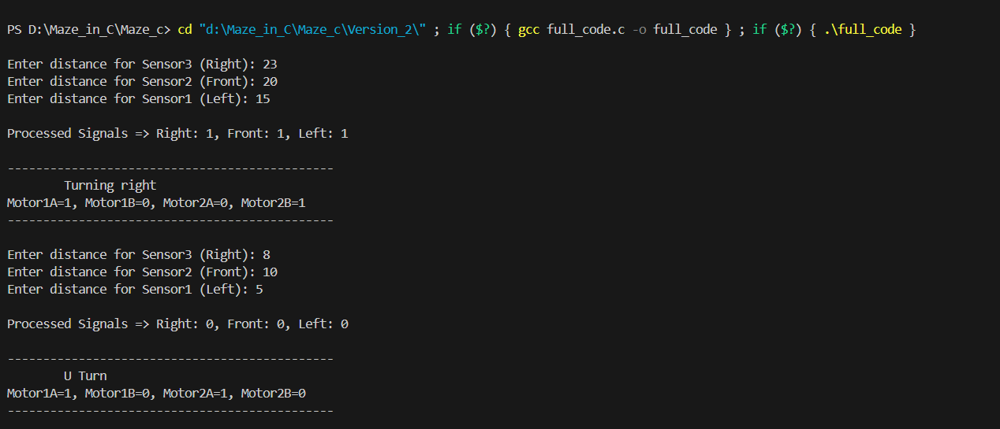

# VSD-FPGA-Based-RISC-V-Maze-Solver
---

## VSDSquadron FM: Hardware Summary


### Key Specifications

| Feature                   | Specification                        |
|---------------------------|------------------------------------|
| **FPGA Chip**             | Lattice UltraPlus ICE40UP5K         |
| **Logic Cells**           | 5,280                              |
| **SPRAM**                 | 1 Mb                              |
| **GPIO Pins**             | 32 accessible FPGA GPIOs            |
| **Memory**                | 4 MB SPI Flash                     |
| **LED Indicators**        | RGB LED                           |
| **Power Regulation**      | Onboard 3.3V regulators             |
| **Dimensions (L × W)**    | 57 mm × 29 mm                     |
| **Max Operating Frequency** | 133 MHz                          |
| **Supported Development Tools** | Project IceStorm, Yosys, NextPNR |


## FPGA-Based RISC-V Maze Solver (C Implementation)

### 📌 Introduction – VSD Squadron FPGA Mini
The **VSD Squadron FPGA Mini** is a compact, low-power FPGA development board designed for experimenting with digital logic design, RISC-V processor implementation, and embedded systems applications. It features:
- **FPGA Device**: Lattice iCE40 series
- **Clock Frequency**: 12 MHz
- **Interfaces**: GPIO, UART, PWM, SPI, and I²C
- **Ideal For**: FPGA beginners, RISC-V architecture learners, robotics and embedded system projects.

This board is used in this project to implement a **RISC-V based maze solver** that uses ultrasonic sensors for wall detection and navigation logic.

---

### 🎯 Project Objective
The key objective of this project is to develop a **microarchitecture (RISC-V controller)** so that the micromouse maze solver bot can find a path from a designated **start point** to an **end point** within a maze, **efficiently and accurately**.

This involves:
- Navigating through a **complex network** of paths and walls.
- Avoiding **dead ends**.
- Using **algorithms** and strategies to explore and solve the maze.
- Adapting to **various maze configurations**.
- Overcoming challenges such as **loops**, **multiple paths**, and **dynamic changes** within the maze environment.

---
### 🔍 Block Diagram
 

---

### 🔄 Flowchart
 

---

## 📂 Project Structure and Versions

### 🚀Version 1 – Modular Implementation
- Files:
  - `main.c` – Main control logic.
  - `UltrasonicSensor.c` – Ultrasonic sensor reading and processing.
  - `UltrasonicSensor.h` – Header file with sensor declarations.
- Features:
  - Sensor and control logic separated for better maintainability.
  - Easier to debug and extend.
- Compile and run:
Absolutely! Here's a clear explanation of the **Compile and Run** section for your README:

---

## main.c
```bash
#include <stdio.h>
#include "UltrasonicSensor.h"

// Motor control variables (simulate motor pins)
int Motor1A=0, Motor1B=0, Motor2A=0, Motor2B=0;

// Function declarations
void moveForward();
void turnRight();
void turnLeft();
void goBack();
void delay(long iterations);

int main() {
    while(1) {
        readAndProcessSensors();

        if(Sensor3 == 1) {
            turnRight();
        }
        else {
            if(Sensor2 == 1) {
                moveForward();
            }
            else if(Sensor1 == 1) {
                turnLeft();
            }
            else {
                goBack();
            }
        }
    }
    return 0;
}

// Movement functions implementation
void moveForward() {
    printf("\n----------------------------------------------");
    printf("\n\tMoving forward");
    Motor1A=1; Motor1B=0;
    Motor2A=1; Motor2B=0;
    printf("\nMotor1A=1, Motor1B=0, Motor2A=1, Motor2B=0");
    printf("\n----------------------------------------------\n");
}

void turnRight() {
    printf("\n----------------------------------------------");
    printf("\n\tTurning right");
    Motor1A=1; Motor1B=0;
    Motor2A=0; Motor2B=1;
    printf("\nMotor1A=1, Motor1B=0, Motor2A=0, Motor2B=1");
    printf("\n----------------------------------------------\n");
    delay(700);
}

void turnLeft() {
    printf("\n----------------------------------------------");
    printf("\n\tTurning left");
    Motor1A=0; Motor1B=1;
    Motor2A=1; Motor2B=0;
    printf("\nMotor1A=0, Motor1B=1, Motor2A=1, Motor2B=0");
    printf("\n----------------------------------------------\n");
    delay(700);
}

void goBack() {
    printf("\n----------------------------------------------");
    printf("\n\tU Turn");
    Motor1A=1; Motor1B=0;
    Motor2A=1; Motor2B=0;
    printf("\nMotor1A=1, Motor1B=0, Motor2A=1, Motor2B=0");
    printf("\n----------------------------------------------\n");
    delay(1400);
}

void delay(long iterations) {
    for(long i = 0; i < iterations; i++) {
        // Empty delay loop for simulation
    }
}

```
---

## UltrasonicSensor.c

```bash
#include <stdio.h>
#include "UltrasonicSensor.h"

int Sensor1 = 0;  // Left Sensor signal
int Sensor2 = 0;  // Front Sensor signal
int Sensor3 = 0;  // Right Sensor signal

#define THRESHOLD 10  // in cm

void readAndProcessSensors() {
    int dist1, dist2, dist3;

    printf("\nEnter distance for Sensor3 (Right): ");
    scanf("%d", &dist3);
    printf("Enter distance for Sensor2 (Front): ");
    scanf("%d", &dist2);
    printf("Enter distance for Sensor1 (Left): ");
    scanf("%d", &dist1);

    // Distance > THRESHOLD → path clear (1), else blocked (0)
    Sensor3 = (dist3 > THRESHOLD) ? 1 : 0;
    Sensor2 = (dist2 > THRESHOLD) ? 1 : 0;
    Sensor1 = (dist1 > THRESHOLD) ? 1 : 0;

    printf("\nProcessed Signals => Right: %d, Front: %d, Left: %d\n", Sensor3, Sensor2, Sensor1);
}
```
---

## UltrasonicSensor.h

```bash

#ifndef ULTRASONICSENSOR_H
#define ULTRASONICSENSOR_H

// Sensor signals: 0 = blocked (low), 1 = clear (high)
extern int Sensor1;  // Left
extern int Sensor2;  // Front
extern int Sensor3;  // Right

// Function to read sensor distances and convert to high/low signals
void readAndProcessSensors();

#endif // ULTRASONICSENSOR_H

```
---
### Compile and Run


**Step 1: Compile the code**

Use the following command to compile `main.c` and `UltrasonicSensor.c` together into a single executable file named `main`:

```bash
gcc main.c UltrasonicSensor.c -o main
```

* `gcc` is the GNU Compiler Collection command for compiling C programs.
* `main.c UltrasonicSensor.c` are the source files being compiled.
* `-o main` specifies the output executable file name (`main`).

If the compilation is successful, no errors will appear, and an executable file named `main` (or `main.exe` on Windows) will be created in your current directory.

---

**Step 2: Run the program**

  ```bash
 .\main.exe
  ```
---

## Sample Output


### 🚀 Version 2 – Single-File Implementation

- **File:**  
  - `full_code.c` – Contains the complete sensor reading, processing, and motor control logic in a single file.

- **Features:**  
  - All code consolidated into one file for simplicity.  
  - Easy to modify and understand as a standalone program.
 
## full_code.c

```bash

#include <stdio.h>

// ---------------------- Sensor Module ----------------------
// Sensor signals: 0 = low (blocked), 1 = high (clear)
int Sensor1 = 0;  // Left Sensor
int Sensor2 = 0;  // Front Sensor
int Sensor3 = 0;  // Right Sensor

#define THRESHOLD 10  // Threshold in cm

void readAndProcessSensors() {
    int dist1, dist2, dist3;

    printf("\nEnter distance for Sensor3 (Right): ");
    scanf("%d", &dist3);
    printf("Enter distance for Sensor2 (Front): ");
    scanf("%d", &dist2);
    printf("Enter distance for Sensor1 (Left): ");
    scanf("%d", &dist1);

    // Distance > THRESHOLD means path is clear (1), else blocked (0)
    Sensor3 = (dist3 > THRESHOLD) ? 1 : 0;
    Sensor2 = (dist2 > THRESHOLD) ? 1 : 0;
    Sensor1 = (dist1 > THRESHOLD) ? 1 : 0;

    printf("\nProcessed Signals => Right: %d, Front: %d, Left: %d\n",
           Sensor3, Sensor2, Sensor1);
}

// ---------------------- Motor Control ----------------------
int Motor1A=0, Motor1B=0, Motor2A=0, Motor2B=0;

void moveForward();
void turnRight();
void turnLeft();
void goBack();
void delay(long iterations);

// ---------------------- Main Logic ----------------------
int main() {
    while(1) {
        readAndProcessSensors();

        if(Sensor3 == 1) {
            // Right clear → turn right immediately
            turnRight();
        }
        else {
            // Right blocked, check front and left
            if(Sensor2 == 1) {
                moveForward();
            } 
            else if(Sensor1 == 1) {
                turnLeft();
            } 
            else {
                goBack();
            }
        }
    }
    return 0;
}

// ---------------------- Movement Functions ----------------------
void moveForward() {
    printf("\n----------------------------------------------");
    printf("\n\tMoving forward");
    Motor1A=1; Motor1B=0;
    Motor2A=1; Motor2B=0;
    printf("\nMotor1A=1, Motor1B=0, Motor2A=1, Motor2B=0");
    printf("\n----------------------------------------------\n");
}

void turnRight() {
    printf("\n----------------------------------------------");
    printf("\n\tTurning right");
    Motor1A=1; Motor1B=0;
    Motor2A=0; Motor2B=1;
    printf("\nMotor1A=1, Motor1B=0, Motor2A=0, Motor2B=1");
    printf("\n----------------------------------------------\n");
    delay(700);
}

void turnLeft() {
    printf("\n----------------------------------------------");
    printf("\n\tTurning left");
    Motor1A=0; Motor1B=1;
    Motor2A=1; Motor2B=0;
    printf("\nMotor1A=0, Motor1B=1, Motor2A=1, Motor2B=0");
    printf("\n----------------------------------------------\n");
    delay(700);
}

void goBack() {
    printf("\n----------------------------------------------");
    printf("\n\tU Turn");
    Motor1A=1; Motor1B=0;
    Motor2A=1; Motor2B=0;
    printf("\nMotor1A=1, Motor1B=0, Motor2A=1, Motor2B=0");
    printf("\n----------------------------------------------\n");
    delay(1400);
}

void delay(long iterations) {
    for(long i = 0; i < iterations; i++) {
        // empty loop for delay simulation
    }
}

```

- ### **Compile and run:**

  **Step 1: Compile the code**

  ```bash
  gcc full_code.c -o full_code
  ```


  


 
